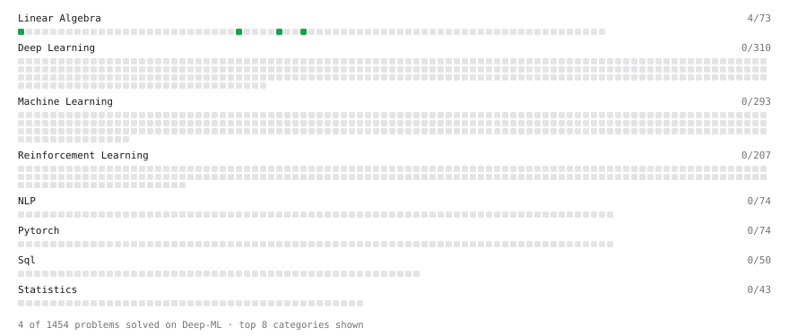

# Deep-ML

My machine learning practice from [Deep-ML](https://www.deep-ml.com). Every solution here was written by hand.

**4** solved · 2 problems · 0 labs · 2 math

[**Browse the interactive portfolio**](https://Qw1nti.github.io/deep-ml/) to replay this filling in over time.

## Problems

| | Difficulty | Solved | |
| --- | --- | --- | --- |
| [Matrix-Vector Dot Product](https://www.deep-ml.com/problems/1) | easy | 2026-09-24 | [solution](problems/0001-matrix-vector-dot-product) |
| [Vector Element-wise Sum](https://www.deep-ml.com/problems/121) | easy | 2026-09-28 | [solution](problems/0121-vector-element-wise-sum) |

## Math

| | Difficulty | Solved | |
| --- | --- | --- | --- |
| [Matrix Multiplication](https://www.deep-ml.com/math-problems/10) | medium | 2026-09-25 | [solution](math/0010-matrix-multiplication) |
| [Vector Norms and Linear Independence](https://www.deep-ml.com/math-problems/8) | medium | 2026-09-28 | [solution](math/0008-vector-norms-and-linear-independence) |

---

_This file is regenerated by Deep-ML on every push._
